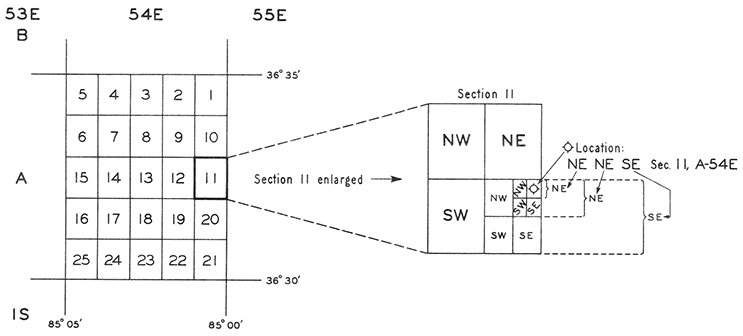
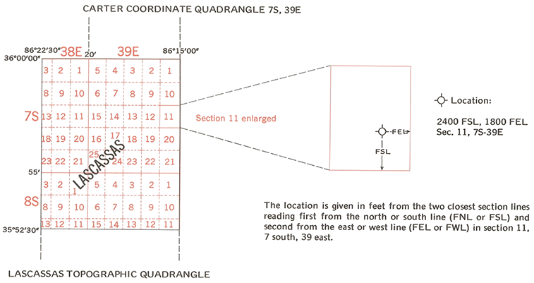

# Tennessee Coordinate Converter

Tennessee Coordinate Converter is a desktop and command-line application for
converting between coordinate systems commonly used in Tennessee. Geographic (Lat/Lon), Tennessee State
Plane, and UTM coordinates in common datums are supported. Additionally, the arcane Carter
coordinate system used historically in Tennessee for locating wells is also supported. 

The project is being prepared as an open-source repository at
[alwunder/tn-coordinate-converter](https://github.com/alwunder/tn-coordinate-converter).

## Features

- Convert a single coordinate in the Tkinter desktop interface.
- Batch-convert CSV and JSON files from the desktop interface or command line.
- Convert Carter coordinates to and from NAD27 without an external lookup
  table.
- Read complete or partial legacy Carter quadrant calls and represent the most
  specific supplied subdivision by its center point.
- Transform geographic and projected coordinates with `pyproj`.
- Display converted locations in the NGMDB MapView on supported Windows
  systems.
- Use the standalone Carter conversion module without third-party
  dependencies.

## Supported coordinate formats

| Format | Command-line name | Units |
| --- | --- | --- |
| Carter Coordinates | `CARTER` | Grid/section notation; U.S. survey feet for footage offsets |
| Latitude/Longitude (NAD27) | `GEOGRAPHIC_NAD27` | Decimal degrees |
| Latitude/Longitude (NAD83) | `GEOGRAPHIC_NAD83` | Decimal degrees |
| Latitude/Longitude (WGS84) | `GEOGRAPHIC_WGS84` | Decimal degrees |
| Tennessee State Plane, NAD27 | `TNSPC_NAD27` | U.S. survey feet |
| Tennessee State Plane, NAD83 | `TNSPC_NAD83` | Meters |
| Tennessee State Plane, NAD83 | `TNSPC_NAD83_FTUS` | U.S. survey feet |
| UTM Zone 15N, NAD27/NAD83 | `UTM15_NAD27`, `UTM15_NAD83` | Meters |
| UTM Zone 16N, NAD27/NAD83 | `UTM16_NAD27`, `UTM16_NAD83` | Meters |
| UTM Zone 17N, NAD27/NAD83 | `UTM17_NAD27`, `UTM17_NAD83` | Meters |

### Carter coordinates

The Carter Coordinate System adapts the township-and-range concept to a grid
of 5-minute latitude/longitude quadrangles. The Tennessee and Kentucky grid
uses 89 degrees 30 minutes west longitude and 36 degrees 30 minutes north
latitude as its origin. South of the origin, townships are numbered `1S`,
`2S`, and so on; north of it they are lettered `A`, `B`, `C`, and so on.
Tennessee ranges are numbered east or west of the origin as `1E`, `2E`, or
`1W`, `2W`, for example.

Each quadrangle contains twenty-five 1-minute sections in a 5-by-5 grid. The
sections follow a back-and-forth pattern: section 1 is in the northeast,
section 5 is in the northwest, and numbering continues by alternating
direction until section 25 in the southwest.

Carter records use either of two location conventions within a section:

- **Legacy quadrant notation** recursively quarters the section. Calls are
  written from the smallest supplied subdivision to the largest, so
  `NE NE SE` means the northeast quarter of the northeast quarter of the
  southeast quarter. To locate it spatially, read the calls in reverse:
  `SE`, then `NE`, then `NE`.

    

    *Bulletin 62 illustration: the 25-section grid and a legacy location written
as `NE NE SE Sec. 11, A-54E`.*

- **Footage notation** gives the north-south distance first from `FNL` or
  `FSL`, followed by the east-west distance from `FEL` or `FWL`. For example,
  `2400 FSL, 1800 FEL, Sec. 11, 7S-39E` describes a point measured from the
  south and east section lines.

    

    *Bulletin 76 illustration: Carter grids within a 7.5-minute topographic quadrangle and
the footage-from-section-lines convention.*

The converter also accepts incomplete Carter locations. Township/range alone
resolves to the center of the 5-minute quadrangle; adding a section resolves
to the section center. One, two, or three legacy calls resolve to the center
of the largest, middle, or smallest supplied subdivision, respectively.
Approximate results are identified by `carter_complete`, `location_method`,
and `location_note` in the output.

Historical source material is available in the
[Carter explanation document](<explanation/Explanation of Carter Coordinate System.docx>)
and its [plain-text transcription](explanation/CarterCoordExpText.txt).

## Requirements

- Python 3.10 or newer
- `pyproj` for geographic and projected transformations
- Tkinter for the desktop interface; it is included with standard Windows
  Python installations
- For the optional NGMDB MapView on Windows: `pywebview`, Python.NET, and the
  Microsoft Edge WebView2 Runtime

Coordinate conversion works without internet access. The NGMDB map requires
access to `https://ngmdb.usgs.gov`.

## Install from source

Clone the repository and create an isolated environment:

```powershell
git clone https://github.com/alwunder/tn-coordinate-converter.git
Set-Location .\tn-coordinate-converter
python -m venv .venv
.\.venv\Scripts\Activate.ps1
python -m pip install --upgrade pip
python -m pip install -e ".[map]"
```

The `map` extra installs the Windows map-window dependencies. For conversion
without MapView, install with `python -m pip install -e .` instead.

Start the desktop application:

```powershell
tn-coordinate-converter-gui
```

The source file can also be run directly:

```powershell
python .\tn_coord_converter_gui.py
```

## Single conversions

The desktop application contains three tabs:

- **Single Conversion** converts one location at a time.
- **Batch Conversion** processes every record in a CSV or JSON file.
- **About** displays this guide.

For Carter input, provide section, township, range, north-south footage and
reference line, and east-west footage and reference line. For example:

```text
Section:       11
Township:      2S
Range:         47E
N-S Distance:  1750
From N-S Line: FSL
E-W Distance:  1900
From E-W Line: FWL
```

The approximate NAD27 result is:

```text
Latitude:   36.3714736806
Longitude: -85.5935471530
```

Legacy Bulletin 62 quadrant calls are also accepted in place of the four
footage fields. Enter the calls from the smallest subdivision to the largest,
as originally printed. Because a quadrant call identifies an area rather than
an exact well point, the converter uses the center of the most specific
subdivision supplied:

- One call is the largest quadrant.
- Two calls are the middle and largest quadrants.
- Three calls are the smallest, middle, and largest quadrants.

```text
Section:    11
Township:   A
Range:      54E
Quadrants:  NE NE SE
```

After a successful single conversion, **Copy X**, **Copy Y**, and **Copy X,Y**
copy result coordinates to the clipboard. Select **Invert** to change the
combined button to **Copy Y,X**. Longitude is X and latitude is Y.
For a Carter target, the copied X/Y pair is the accompanying Tennessee State
Plane NAD27 coordinate.

Partial Carter coordinates are valid when township and range are known. A
township/range-only record resolves to the center of its 5-minute quadrangle;
adding a section resolves to the center of that section. Outputs set
`carter_complete` to `false` and include `location_method` and `location_note`
so these approximate centers are not mistaken for precisely located points.

For geographic input, enter longitude and latitude in decimal degrees. For a
projected source, enter easting/X and northing/Y in the units listed above.

When Carter coordinates are the target, the result includes the containing
section, township, range, and footage from the nearest section lines.

## Batch conversion

The batch interface and command line accept `.csv` and `.json` inputs. The
output filename extension selects CSV or JSON output. Existing input fields
are retained and converted values are appended.

### Carter CSV

```csv
section,township,range,ns_feet,fsl_fnl,ew_feet,fwl_fel
11,2S,47E,1750,FSL,1900,FWL
15,2S,48E,1500,FSL,1950,FEL
```

Accepted Carter columns include:

| Value | Accepted columns |
| --- | --- |
| Section (optional) | `section` |
| Township | `township` |
| Range | `range` or `range_` |
| N-S footage | `ns_feet` or `north_south_feet` |
| N-S line | `fsl_fnl` or `ns_line` |
| E-W footage | `ew_feet` or `east_west_feet` |
| E-W line | `fwl_fel` or `ew_line` |

For a legacy Carter record, use `quadrants` (also accepted: `quadrant`,
`quarter_calls`, or `quarter_quadrants`) instead of all four footage fields.
Township and range are the minimum fields; section and quadrants may be left
blank for poorly located records.

```csv
section,township,range,quadrants
"",A,54E,""
11,A,54E,""
11,A,54E,SE
11,A,54E,"NE SE"
11,A,54E,"NE NE SE"
```

### Geographic or projected CSV

Geographic input may use `lat` and `lon`, `latitude` and `longitude`,
`y_lat27` and `x_lon27`, or `y_lat83` and `x_lon83`.

```csv
latitude,longitude
36.3714736806,-85.5935471530
```

Projected input may use `x` and `y`, or `easting` and `northing`. Select the
source format explicitly because those column names do not identify a CRS.

```csv
x,y
2119668.814,720797.189
```

### JSON

Coordinate pairs in JSON output consistently place the X-like value before the
Y-like value: `lon` before `lat` for geographic coordinates and `x` before `y`
for projected coordinates.

JSON input may be a list of records:

```json
[
  {
    "section": 11,
    "township": "2S",
    "range": "47E",
    "ns_feet": 1750,
    "fsl_fnl": "FSL",
    "ew_feet": 1900,
    "fwl_fel": "FWL"
  }
]
```

An object containing a `records` list is also accepted.

### Command line

Carter CSV to NAD27 latitude/longitude:

```powershell
tn-coordinate-converter `
  --input .\sample_carter_input.csv `
  --output .\sample_carter_output.csv `
  --source-format CARTER `
  --target-format GEOGRAPHIC_NAD27 `
  --no-gui
```

NAD27 JSON to Carter coordinates:

```powershell
tn-coordinate-converter `
  --input .\sample_latlon_input.json `
  --output .\sample_latlon_output.json `
  --source-format GEOGRAPHIC_NAD27 `
  --target-format CARTER `
  --no-gui
```

Use `--source-format AUTO` when the first record has recognizable Carter or
NAD27 latitude/longitude fields. The target format is always required.

## Use as a Python module

`tn_coord_converter_module.py` contains the Carter/NAD27 calculations and has no
third-party dependencies.

```python
from tn_coord_converter_module import carter_to_nad27, nad27_to_carter

coordinate = carter_to_nad27(
  section=11,
  township="2S",
  range_="47E",
  ns_feet=1750,
  ns_line="FSL",
  ew_feet=1900,
  ew_line="FWL",
)

carter = nad27_to_carter(
  nad27_lat=coordinate.nad27_lat,
  nad27_lon=coordinate.nad27_lon,
)
```

The standalone module uses the Clarke 1866 ellipsoid associated with NAD27
and reports ground distances in U.S. survey feet.

## MapView

After a successful desktop conversion, select **View on map** to open or
update the NGMDB MapView window. Install the `map` extra and verify that the
Microsoft Edge WebView2 Evergreen Runtime is installed if the map does not
open. Conversion remains available when MapView is unavailable.

Map errors are written to the temporary file
`tn_coord_converter_mapview.mapview-error.log`.

## Development

Install development and map dependencies:

```powershell
python -m pip install -e ".[dev,map]"
python -m pytest
python -m ruff check .
```

The repository intentionally excludes generated executables, build output,
IDE settings, and caches.

## Project layout

| Path | Purpose |
| --- | --- |
| `tn_coord_converter_gui.py` | Desktop interface, batch processing, and CLI |
| `tn_coord_converter_module.py` | Standalone Carter/NAD27 calculations |
| `tn_coord_converter_version.py` | Release and product metadata |
| `ngmdb_mapview_window.py` | NGMDB MapView integration |
| `explanation/` | Historical Carter explanation text and illustrations |
| `tests/` | Automated conversion and CLI tests |
| `sample_carter_input.csv` | Example Carter batch input |
| `sample_carter_quadrant_input.csv` | Example legacy Carter quadrant input |
| `sample_latlon_input.json` | Example NAD27 batch input |

## Contributing and security

See [CONTRIBUTING.md](CONTRIBUTING.md) for the development workflow and
[SECURITY.md](SECURITY.md) for responsible vulnerability reporting.

## License

This project is dedicated to the public domain under the
[CC0 1.0 Universal license](LICENSE).
